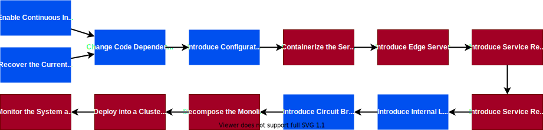

# Overview

In this exercise, you will learn how to migrate from a legacy monolith
application to cloud-native microservices. We'll use Martin Fowler's
[Strangler Fig Application][1] practices to slowly strangle away from a legacy
system using microservices. The Microservices migration process depends on the
legacy application. However, it can be described by the following steps:

The migration of the production-grade application must take into consideration
many aspects, such as data migration and zero downtime. Going through the entire
process can take many months. You can read more in **[this research paper][2]**.

Due to limited time in this class, you will perform a subset of steps (marked as
red) on a very simple application. Mainly, you will:

1. Deploy legacy monolith application in Docker container.
1. Deploy [Netflix Open Source Software][2] (Netflix OSS)
  - Eureka - service discovery
  - Zuul - gateway proxy
  - Zipkin - request tracing
1. Break monolith into several microservices
1. Strangle legacy application with new microservices deployed in Docker

## [Why it Matters][6]

Traditional monolithic architectures are hard to scale. As an application's code
basegrows, it becomes complex to update and maintain. Introducing new features,
languages, frameworks, and technologies becomes very hard, limiting innovation
and new ideas.

Within a microservices architecture, each application component runs as its own
service and communicates with other services via a well-defined API.
Microservices are built around business capabilities, and each service performs
a single function. Microservices can be written using different frameworks and
programming languages, and you can deploy them independently, as a single
service, or as a group of services.

## Prerequisites

In this course, you will use:

- Docker
- Docker Compose
- Github
- Java with Maven
- Python

To complete this course, make sure that you have the following tools:

- Docker CE - [installation guide][4]
- Docker Compose - [installation guide][5]
- Git client
- Java
- Maven

[1]: https://martinfowler.com/bliki/StranglerFigApplication.html
[2]: https://onlinelibrary.wiley.com/doi/pdf/10.1002/spe.2608?casa_token=WBkf71wnymoAAAAA%3AaRt3wSvvVRxZtlxTpwZbK1F_WzWZMAb9zgcszczVh1SeyMlnXWrLp-aCvcL7JY-oaPqoaVFsMYOeXg
[3]: https://netflix.github.io/
[4]: https://docs.docker.com/engine/install/
[5]: https://docs.docker.com/compose/install/
[6]: https://aws.amazon.com/getting-started/hands-on/break-monolith-app-microservices-ecs-docker-ec2/
