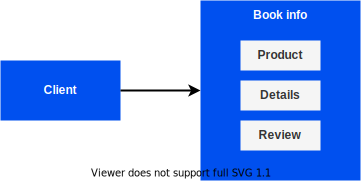

# Overview

In this exercise we we will learn how to migrate from legacy monolith
application to the cloud-native microservices. We'll use practices from Martin
Fowler's [Strangler Fig Application][1] to slowly strangle domain data away from
a legacy system using microservices.

In this classes we will:

1. Deploy legacy monolith application in Docker container.
1. Deploy [Netflix Open Source Software][2] (Netflix OSS)
  - Eureka
  - Zuul
1. Break monolith into several microservices
1. Strangle legacy application with new microservices deployed in Docker

## Why it Matters

<!-- TODO: This section is copied from the AWS tutorial:
https://aws.amazon.com/getting-started/hands-on/break-monolith-app-microservices-ecs-docker-ec2/
-->

Traditional monolithic architectures are hard to scale. As an application's code
base grows, it becomes complex to update and maintain. Introducing new features,
languages, frameworks, and technologies becomes very hard, limiting innovation
and new ideas.

Within a microservices architecture, each application component runs as its own
service and communicates with other services via a well-defined API.
Microservices are built around business capabilities, and each service performs
a single function. Microservices can be written using different frameworks and
programming languages, and you can deploy them independently, as a single
service, or as a group of services.

## Monolith Application Architecture

During this classes, we will show you how to run a sample monolith application
in a Docker container, run it with Docker Compose. This sample application is
written in Java with use of [Spring framework][3]. The following diagram
presents application architecture.

## Prerequisites

In this course you will use:

- Docker
- Docker Compose
- Github
- Java with Maven
- Python

To complete this course make sure that you have the following tools:

- Docker CE - [installation guide][4]
- Docker Compose - [installation guide][5]
- Git client
- Java
- Maven

[1]: https://martinfowler.com/bliki/StranglerFigApplication.html
[2]: https://netflix.github.io/
[3]: https://spring.io/
[4]: https://docs.docker.com/engine/install/
[5]: https://docs.docker.com/compose/install/
