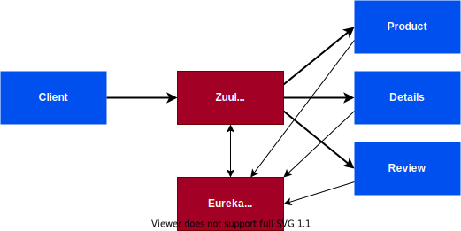

# Strangle the Monolith

In this module, you will break the Monolith application into several
interconnected servies and strangle old application.

## Desired architecture overview

## Why Microservices?

<!-- TODO: Rewrite this section -->

### Isolation of Crashes

Even the best engineering organizations can and do have fatal crashes in
production. In addition to following all the standard best practices for
handling crashes gracefully, one approach that can limit the impact of such
crashes is building microservices. Good microservice architecture means that
if one micro piece of your service is crashing, then only that part of your
service will go down. The rest of your service can continue to work properly.

### Isolation for Security

In a monolithic application if one feature of the application has a security
breach, for example a vulnerability that allows remote code execution, then you
must assume that an attacker could have gained access to every other feature of
the system as well. This can be dangerous if, for example, your avatar upload
feature has a security issue which ends up compromising your database with user
passwords. Separating features into microservices using Amazon ECS allows you to
secure access to AWS resources by giving each service its own AWS Identity and
Access Management (IAM) role. When microservice best practices are followed, the
result is that if an attacker compromises one service, they only gain access to
the resources of that service, and cannot horizontally access other resources
from other services without breaking into those services as well.

### Independent Scaling

When features are broken out into microservices, then the amount of
infrastructure and number of instances used by each microservice class can be
scaled up and down independently. This makes it easier to measure the cost of a
particular feature and identify features that may need to be optimized first. If
one particular feature is having issues with its resource needs, other features
will not be impacted and reliable performance can be maintained.

### Development Velocity

Microservices lower the risks in development, which can enable a team to build
faster. In a monolith, adding a new feature can potentially impact every other
feature that the monolith contains. Developers must carefully consider the
impact of any code they add, and ensure that they do not break anything. On the
other hand, a proper microservice architecture has new code for a new feature
going into a new service. Developers can be confident that any code they write
will actually not be able to impact the existing code at all unless they
explicitly write a connection between two microservices.
